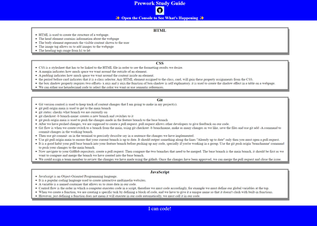
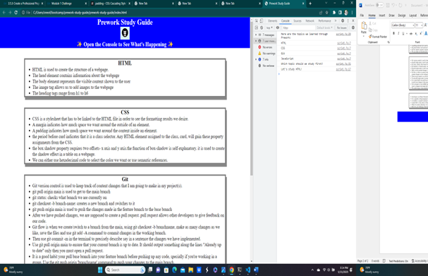

# Prework-study-guide
A study guide for course prework. 

## Description

My motivation to learn new skills helped me build this webpage. This guide was created for George Washington bootcamp students who are currently enrolled, like myself, to help in completing the Prework. The notes in this guide cover the basics of HTML, CSS, Git, and JavaScript. This project will help the students save time as they do not need to write down notes during lectures. 

## Installation

The webpage can be accessed using Google Chrome. Since it is a basic page, it may work the same for all the browsers, however , you may not be able to use Chrome development tools. To add Chrome extension, go to Chrome Web Store - look for Chrome DevTools - Install the extension. This extension will allow you to view and edit your prework study guide webpage.

## Usage
This reference guide can be used by the bootcamp students to review notes in the each section. This topics covered in this unit are HTML, CSS, JavaScript, and Git. You will be able to review suggestions on which topic to study first by right clicking and choosing Inspect on the drop down menu, or, simply press Ctrl+Shift+I if you're a windows user, for Mac users press Command+Option+I. A Console panel should open withing the webpage, on the right side, or at the bottom. You will be able to see the list of topics covered in the prework, and a suggestion on what you can choose to study first. For reference- view  , 

## Credits

Credits go to all the beautiful people who made this course possible and more importantly who provided detailed instrucstions on how to go about completing this prework study guide. Thank you. 

## License

Please refer to the MIT LICENSE in the repository.